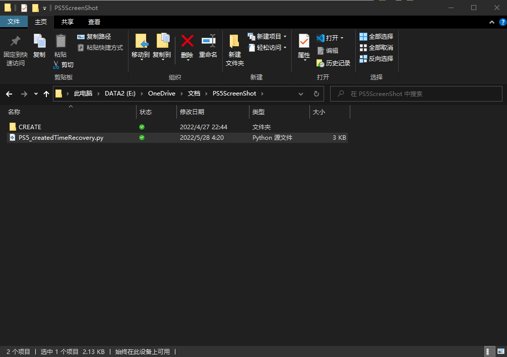
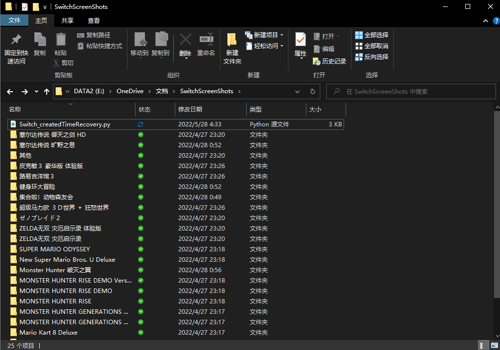

## PS5和Switch截图，视频导出后保存到电脑，创建时间错乱的修复

+ 有趣的截图，具有纪念意义的视频我们想长期储存，或者备份到云端，现在的相册多有“去年今日”功能，该功能基于图片的创建时间，如若创建时间不对，将影响该功能的使用体验

+ 脚本基于python3实现，修复方法基于主机中保存的文件名，文件名包含图片和视频文件的创建信息

+ 使用方法：

+ + 该脚本会自动处理修复文件夹及其子文件夹下的所有jpg图片和mp4视频的创建时间
  + 因为switch和PS5平台的命名结构不同，故采用两个不同的脚本
  + 将PS5_createdTimeRecovery.py放置于PS5导出文件夹的‘CREATE文件夹’中运行即可

  

  + 将Switch_createdTimeRecovery.py放置于Switch导出文件夹中即可

  

